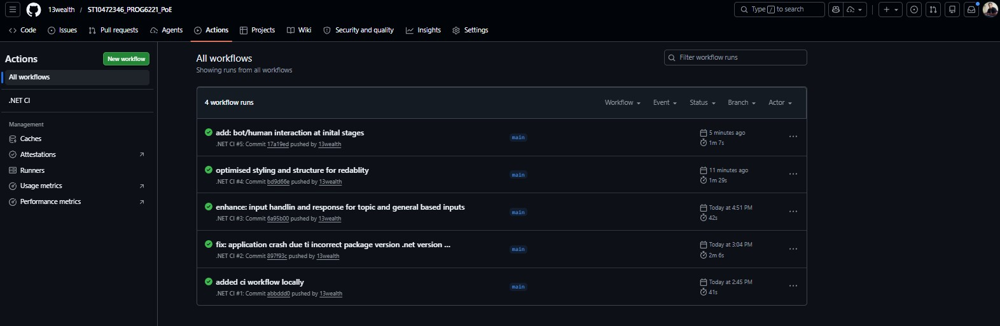

# Cybersecurity Chatbot

A C# console application that teaches basic cybersecurity awareness topics such as phishing, password safety and suspicious links.

## Project Structure

- `CyberBot/Cybersecurity_Chatbot.sln` - Solution file
- `CyberBot/Cybersecurity_Chatbot/Cybersecurity_Chatbot.csproj` - Main project (.NET 10)
- `.github/workflows/ci.yml` - GitHub Actions CI workflow

## Prerequisites

- .NET SDK 10.0 or later
- Windows recommended (welcome sound uses `SoundPlayer`)

## Run Locally

From the repository root:

```powershell
cd CyberBot/Cybersecurity_Chatbot
dotnet run
```

Or run from the solution path:

```powershell
dotnet run --project CyberBot/Cybersecurity_Chatbot/Cybersecurity_Chatbot.csproj
```

## Build

```powershell
dotnet restore CyberBot/Cybersecurity_Chatbot.sln
dotnet build CyberBot/Cybersecurity_Chatbot.sln --configuration Release
```

## Test

```powershell
dotnet test CyberBot/Cybersecurity_Chatbot.sln --configuration Release
```

## CI

GitHub Actions workflow runs on pushes and pull requests to `main` and performs:

1. Restore
2. Build
3. Test

Workflow file: `.github/workflows/ci.yml`

## CI Pipeline Status



## References

- OpenAI. (2026). ChatGPT (GPT-5.3-mini) assistance for ASCII art animation. https://chat.openai.com/
- Patorjk.com. (n.d.). Text to ASCII Art Generator (TAAG). https://patorjk.com/software/taag/

